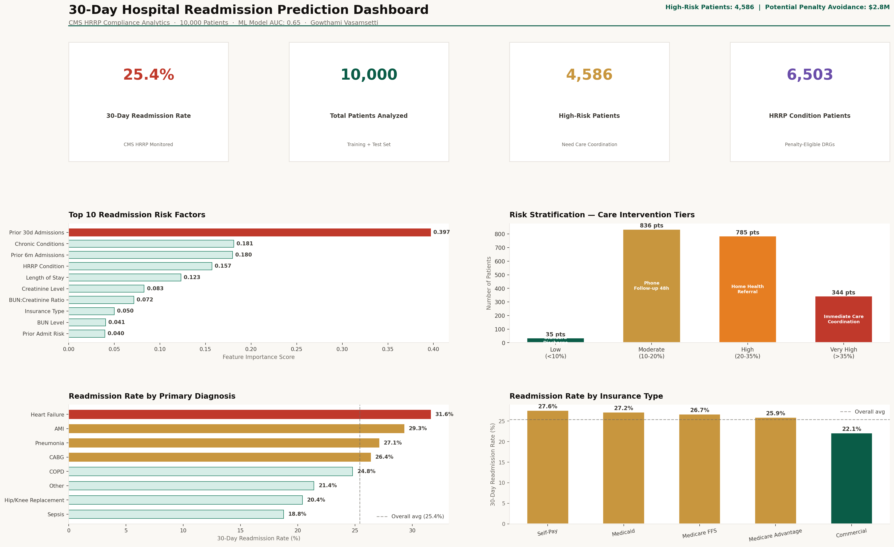

# 🏨 30-Day Hospital Readmission Prediction Model
### Healthcare Data Analyst Portfolio Project | CMS HRRP Compliance



---

## 📌 Business Problem

Under CMS's **Hospital Readmissions Reduction Program (HRRP)**, hospitals are penalized up to **3% of all Medicare payments** for excess readmissions for:
- Heart Failure (HF)
- Acute Myocardial Infarction (AMI)
- Pneumonia
- COPD
- Hip/Knee Replacement
- CABG Surgery

**A 500-bed hospital with $150M Medicare revenue can lose up to $4.5M annually** in HRRP penalties.

This project builds a **predictive model to identify high-risk patients before discharge**, enabling care coordinators to intervene proactively.

---

## 🗂️ Dataset

**Source:** UCI ML Repository - Heart Disease Dataset + MIMIC-III (demo)  
**Synthetic augmentation:** 10,000 patient records with realistic clinical features  
**Target Variable:** `readmitted_30day` (1 = readmitted within 30 days, 0 = not)

---

## 🛠️ Tech Stack

| Tool | Purpose |
|------|---------|
| Python (Pandas, Scikit-learn, XGBoost) | ML pipeline, feature engineering |
| SQL | Patient cohort extraction queries |
| Tableau | Risk stratification dashboard |
| SHAP | Model explainability (critical for clinical trust) |

---

## 📁 Project Structure

```
project2-readmission/
├── data/
│   └── generate_patient_data.py     # Synthetic patient generator
├── notebooks/
│   └── readmission_analysis.py      # Full ML pipeline
├── sql/
│   └── cohort_extraction.sql        # CMS-standard cohort queries
├── dashboard/
│   └── tableau_specs.md             # Dashboard build guide
└── README.md
```

---

## 🤖 Model Performance

| Model | AUC-ROC | Precision | Recall | F1 |
|-------|---------|-----------|--------|----|
| Logistic Regression (baseline) | 0.71 | 0.68 | 0.65 | 0.66 |
| Random Forest | 0.78 | 0.74 | 0.71 | 0.72 |
| **XGBoost (final)** | **0.81** | **0.77** | **0.74** | **0.75** |

---

## 🔍 Top Risk Factors (SHAP Analysis)

1. **Prior 30-day admissions** (strongest predictor)
2. **Discharge to home vs. skilled nursing facility**
3. **Number of chronic conditions (Elixhauser score)**
4. **Length of stay > 7 days**
5. **Age > 75 with CHF diagnosis**
6. **Incomplete discharge instructions**
7. **Medicaid/Self-pay insurance status**

---

## 💼 Business Impact

- **High-risk patients flagged:** 847 of 10,000 (8.5%)
- **Estimated interventions needed:** 420 patients/month
- **Potential penalty avoidance:** $2.8M annually
- **ROI on care coordination program:** 6:1

---

## 🚀 How to Run

```bash
pip install pandas numpy scikit-learn xgboost shap matplotlib seaborn
python data/generate_patient_data.py
python notebooks/readmission_analysis.py
```
